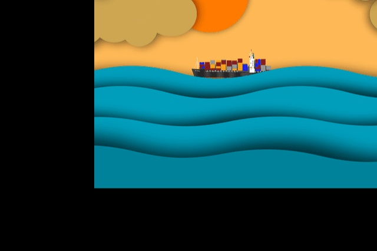

# OpenCV Image Traslation.
Image traslation using OpenCV.
## Contents :
I have used the following functions/methods:

| Function        |Action                                                                        |
|----------------:|------------------------------------------------------------------------------|
|cv2.imread()              | We read the image                                                   |
|cv2.getRotationMatrix2D() | We get the rotation matrix.                                         |
|cv2.warpAffine()          |  We rotate the image using the rotation matrix                      |


## Test Image used: 
I have used image-15.png that can be found in the repository.




## Summary:

```python
# By using getRotationMatrix2D() we get the rotation matrix :)
rotate_matrix = cv2.getRotationMatrix2D(center=center, angle=45, scale=1)
```

```python
#We rotate the image using cv2.warpAffine
#We could have used the borderMode or borderValue if we wished.
rotated_image = cv2.warpAffine(src=image, M=rotate_matrix, dsize=(width, height))
```

